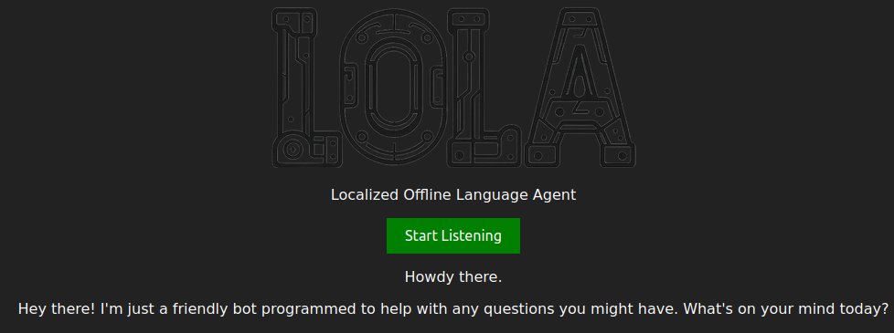

<p align="center">
	
</p>

<h1 align="center">LOLA</h1>

<p align="center">
	<strong>Localized Offline Language Agent</strong>
</p>

## 🚀 Overview

Welcome to **LOLA** (*the JARVIS of today*)! This program allows you to converse verbally with an AI assistant and get verbal responses extremely quickly. It is designed to be user-friendly and efficient, making it easy for anyone to use.

## 🎨 Features

- 🌑 **Dark Theme**: The program features a sleek dark theme that is easy on the eyes and provides a modern look.
- ⚡ **Blazingly Fast**: Users can easily drag and drop files into the program for conversion, making the process quick and intuitive.
- 🗣️ **Voice Interaction**: The program supports voice interaction, allowing users to converse with the AI assistant using natural language.

## 🛠️ Installation

**Clone the Repository**
```sh
$ git clone https://github.com/321BadgerCode/lola.git
$ cd ./lola/
```
> [!NOTE]
> On Windows, use `\` instead of `/` for traversing file structures.

<details>

<summary>📦 Dependencies</summary>

- **Python Packages**: The program uses several Python packages. You can install them using pip:
```sh
$ pip install -r requirements.txt
```
- **Ollama**: The program requires [Ollama](https://ollama.com/) to be installed.
```sh
$ curl -fsSL https://ollama.com/install.sh | sh
```

</details>

To install the default Ollama model, you can use the following command:
```sh
$ ollama pull mistral:7b-instruct-q4_K_M
```

> [!NOTE]
> By default, the program uses the `mistral:7b-instruct-q4_K_M` LLM (*as seen in `config.json`*) for the AI assistant. You can change this to any other model supported by Ollama, as long as you have it downloaded and adjust it in the `config.json` file.

## 📈 Usage

To use the program, you can either run it in python or within a [Docker](https://www.docker.com/) container:

### Using Python

**Run the program**
```sh
$ python ./app.py
```

### Using Docker

<details>

<summary>📝 Docker Notes</summary>

1. Ensure you have Docker installed on your system. You can find installation instructions on the [Docker website](https://docs.docker.com/get-docker/).
2. The program uses Docker Compose to manage the container. Make sure you have Docker Compose installed as well.
3. The program uses the `docker compose` command, which is the newer syntax for Docker Compose. If you have an older version of Docker Compose, you may need to use `docker-compose` instead.
4. Some helpful commands:
```sh
$ groups # Check your user groups (you should see `docker` in the list)
$ newgrp docker # Create a new group session with the `docker` group
$ sudo usermod -aG docker $USER && sudo reboot # Add your user to the Docker group and reboot
$ docker builder prune # Clean up unused Docker build cache
```

</details>

1. **Build the Docker image**
```sh
$ docker compose up
$ docker compose up -d # Or run in detached mode
```

2. **Access the web interface**
Go to [http://localhost:5000](http://127.0.0.1:5000) in a web browser to access the LOLA web interface.
```sh
$ firefox http://127.0.0.1:5000
```

3. **Stop the Docker container (if ran in detached mode)**
```sh
$ docker ps # List running containers
$ docker compose down
```

4. **Cleanup (optional)**
```sh
$ docker compose down --volumes --remove-orphans # Remove volumes and orphan containers
$ docker images # List docker images
$ docker rmi lola-web # Remove the Docker image
```

## 🖼️ Screenshots

<p align="center">
	
</p>

## 🤝 Contributing

Contributions are welcome! If you have any suggestions or improvements, feel free to open an issue or submit a pull request.

## 📜 License

[LICENSE](./LICENSE)